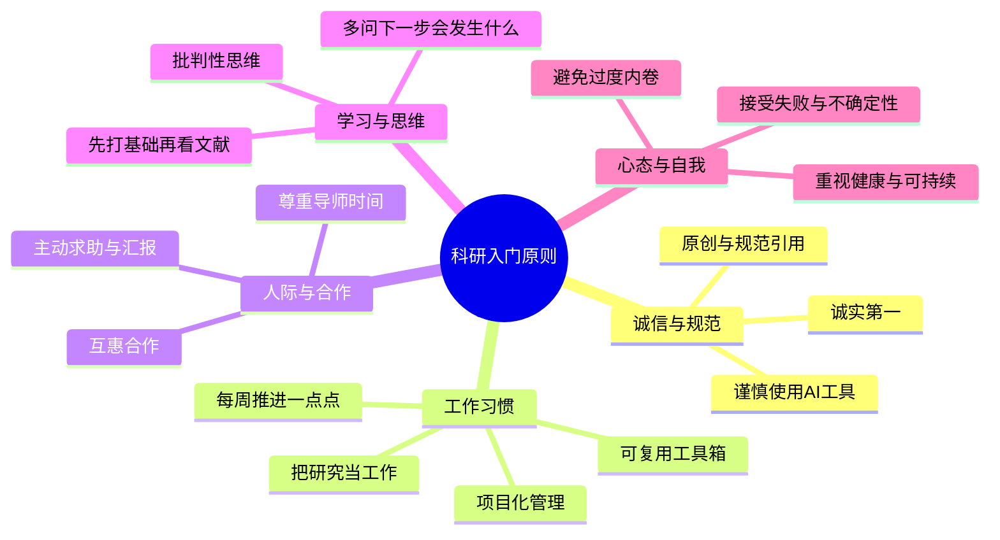

# 研究实践原则

> 前面几页说的是"方法怎么用"，这一页说的是**做研究的人怎么持续把方法用下去**。原则只有落到可执行动作上才有意义。 🌿 扩充中

## 定位

| 坐标 | 取值 |
| --- | --- |
| 内容 | 个人与项目层面的实践原则与可执行条目 |
| 面向对象 | 处于入门到独立阶段的研究者 |
| 与别页关系 | 为 [[从问题到证据]] 等路径页提供行为约束 |
| 落地方式 | 每条规定一个可检查的动作，而不是态度宣言 |

## 五条底层主张

1. **认知资源有限，集中力量解决主要矛盾**：一个阶段只留一个主要矛盾，同时推进三条主线通常三条都推不动。
2. **最小可执行原则，不是准备好了再出发**：不存在"准备好"的时刻，先把最小闭环跑通再迭代。
3. **完成比完美更重要**：可提交的粗糙版本优于停在本地、永远不完整的完美版本。
4. **滴水穿石**：进展来自可累积的小步，而不是等待一次高强度的爆发。
5. **过程归档，路径可视化**：把走过的路记下来，包括失败的路，否则你会重复走一遍。

## 结论速览

- **诚实第一**：不伪造、不篡改、不抄袭，没有商量余地。
- **每周推进一点点，不要断**：用最小可行任务维持研究惯性。
- **主动汇报与求助**：把进展和困惑都说出来，不把自己憋死。
- **把研究当工作，而不是等灵感**：靠谱、守时、有响应、常在现场。
- **所有产出留下可复用的零件**：代码、数据、笔记、参数模板。
- **先打基础，再看文献，再找问题**：避免越学越散。
- **用项目管理的心态做科研**：大目标拆成小任务，设定节点。
- **把健康与可持续放在第一位**：科研是长跑。

## 一、诚信与规范

| 条目 | 可执行做法 | 检查点 |
| --- | --- | --- |
| 诚实第一 | 不伪造、不篡改、不抄袭；原始数据与实验记录完整保留 | 结果"不好看"时的第一反应是查误差与流程，而不是修改数据 |
| 原创意识 | 明确写出"相比已有工作我多做了哪一步" | 能用一句话说清自己的贡献 |
| 规范引用 | 凡他人做过的工作都标来源；软件与数据亦需按其要求引用 | 引用条目与实际使用的工具、数据与图谱版本对应 |
| 谨慎使用 AI 工具 | 用于启发思路、润色表达、检索线索，结论必须自行核实 | 每处结论都能追溯到可核查来源，不把生成内容当作自己的观点 |

## 二、工作习惯

| 条目 | 可执行做法 | 检查点 |
| --- | --- | --- |
| 每周推进一点点 | 设一个"低到不好意思完不成"的每日目标 | 日历上有连续完成记号，没有超过数天的空档 |
| 把研究当工作 | 定时到场、守约、及时回应 | 靠日程表推进，而不是靠灵感 |
| 建立可复用工具箱 | 每完成一项工作花半小时归档：输入、代码、参数、结果、简短 README | 新问题来时是"搭积木"而不是从零开始 |
| 项目化管理 | 拆成可检查的小任务（读文献、学方法、预实验、分析、写作），设时间节点 | 每周更新清单或看板，失控感下降 |

## 三、人际与合作

| 条目 | 可执行做法 | 检查点 |
| --- | --- | --- |
| 主动汇报与求助 | 定期汇报进展与困惑，即使没有正结果 | 讲清"已尝试什么、卡在哪里、希望得到什么帮助" |
| 尊重他人时间 | 会前先发材料与问题清单；邮件说清背景与诉求 | 对方的准备成本被降到最低 |
| 高效反馈 | 对意见有回应："我试了，结果是这样；接下来这样做，您觉得如何" | 反馈闭环，不留悬空问题 |
| 互惠合作 | 明确分工与贡献，避免模糊的"大家一起做" | 署名与贡献说明在开始时就谈清楚 |

## 四、学习与思维

| 条目 | 可执行做法 | 检查点 |
| --- | --- | --- |
| 先打基础 | 先把领域教材与框架弄明白，再读文献，再找问题 | 读论文时能判断它属于哪类问题、哪层尺度 |
| 批判性思维 | 对每篇工作问：假设是否合理、方法是否适用、结论边界在哪 | 不把权威表述当作免检结论，见 [[解释边界与常见错误]] |
| 反事实思考 | 常问"如果结果相反，说明什么" | 能列出与自己的解释竞争的假设 |
| 培养预判 | 读到"未解决问题"时先写下自己的直觉判断，再去查证 | 有可追溯的预判清单，无论对错 |

## 五、心态与自我

| 条目 | 可执行做法 | 检查点 |
| --- | --- | --- |
| 接受失败与不确定性 | 建"失败记录册"，写原因与改进方向 | 把坏结果视为排除了一条路，而不是能力判断 |
| 行为努力，心态放松 | 行为上认真投入，不把每次短期波动当成败 | 不与他人可见成果做简单比较 |
| 避免过度内卷 | 明确自己的节奏与主线，敢于对杂务说不 | 精力主要落在少数主线上 |
| 把健康当成科研的一部分 | 睡眠、运动、社交按计划保留时间 | 长期高压被当作需要处理的问题，而非荣耀 |

## 现在就能开始的三件事

1. 定一个"极小目标"并打卡一周。
2. 主动约一次短沟通，讲清进展、问题与下一步计划。
3. 把手头最常用的一套流程整理成可复用模块，附一个简短 README。

## 相关

- 上级：[[08-设计/index|路径]]
- 路径：[[从问题到证据]]、[[从结果到推断]]
- 一致性：[[分析一致性原则]]、[[质控与可重复性]]
- 规范：[[标准与规范]]
- 学习入口：[[教程与课程]]
