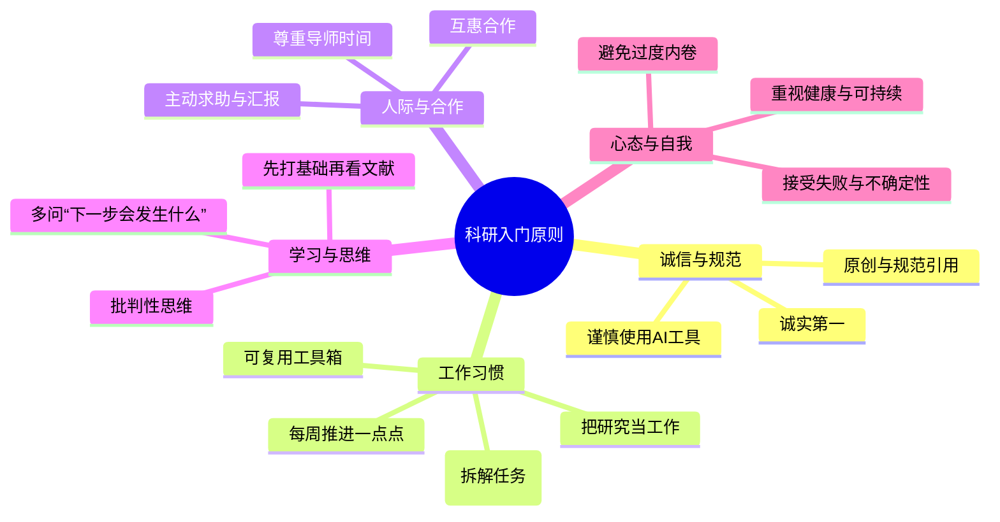

认知资源有限，集中力量解决主要矛盾

最小可执行原则，扎克伯格有句话，没有哪位创业者出发的时就知道要走向何方，到达哪里，都是在路上慢慢探索的。
不是准备好了再出发

完成比完美更重要

滴水穿石；

过程归档，路径可视化

---
下面这些是我结合国内外学者与资深研究者的经验，总结的“刚入门做科研可以立住的个人原则”。尽量做到可执行、少空话。
---
## 结论速览（可以先看这个）
- **诚实第一**：不伪造、不篡改、不抄袭，这是底线，没有商量的余地。
- **每周推进一点点，不要断**：用最小可行任务维持研究惯性，避免“几天不动就荒掉”。
- **主动求助与沟通**：定期与导师、同门交流进展与困惑，不把自己憋死。
- **把研究当“工作”而不是“灵感驱动”**：靠谱、守时、有响应、常在实验室/工位，很多机会由此而来。
- **先打基础，再看文献，再找问题**：体系化入门，避免越学越散。
- **所有产出都留下可复用的“零件”**：代码、数据、笔记标准化归档，形成自己的工具箱。
- **尊重时间，学会说“不”**：把精力留给少数主线，不让杂务吃掉科研时间。
- **训练批判性思维与原创意识**：不盲信权威，敢于提出新问题、新视角。
- **用项目管理的心态做科研**：大目标拆成小任务，设定节点与里程碑，缓解迷茫与失控感。
- **把健康与可持续放在第一位**：科研是长跑，过劳与焦虑会削弱创造力与判断力。
下面用一个简图把这些原则串起来，方便整体把握：

---
## 一、诚信与规范：立身之本（不可妥协）
### 1. 诚实第一，不伪造、不篡改、不抄袭
- 诚实是学术研究的基础，学术不端会对个人声誉造成不可逆的伤害。
- 遇到数据“不好看”时，第一反应应是“为什么会这样/有没有误差/方法是否合理”，而不是“修一修让它好看”。
- 凡是别人做过的工作，都清楚标注来源；自己的原始数据/实验记录保留完整，方便追溯。
### 2. 原创意识：哪怕只是“一点新意”，也要真实
- 研究不要求一上来就颠覆，但要有明确的“自己的贡献”。
- 可以是：新问题、新数据、新方法、新组合、新应用场景、新解释等。
- 尽量避免“换汤不换药”的模仿，学会问自己：“相比已有工作，我到底多做了哪一步？”
### 3. AI 工具要“善用，但不偷懒”
- 不把AI生成内容直接当作自己的观点与文字，而是用来启发思路、润色表达、查找资料。
- 对AI给出的每一处结论都要自己核实、查证，并规范引用来源。
---
## 二、工作习惯：把“感觉好”变成“可执行”
### 4. 每周推进一点点，避免断档
- 设定一个“低到不好意思完不成”的每日目标，比如“打开昨天的文件看一眼”“手写五行推导”。
- 用实体日历/打卡工具记录，连续的“完成记号”会带来正向暗示。
- 状态不好时，只做最小单位的工作：整理参考文献、写注释、画草图——关键是不停。
### 5. 把研究当成“工作”，而不是等灵感
- 把读研/做研究视作一份专业工作：准时、守约、靠谱、有事及时回应。
- 很多机会（新想法、合作、设备使用）都来自于“你在现场/在实验室/在讨论现场”。
- 灵感常常在规律工作的间隙出现，而不是在焦虑等待时蹦出来。
### 6. 建立可复用的“工具箱”：不要每次从零开始
- 每完成一项工作，花半小时归档：输入、代码、参数、结果、说明（写一个简短README）。
- 把可复用部分提炼出来，单独放“工具箱”目录：如数据处理脚本、可视化模板、参数设置模板等。
- 后续新问题来时，你是在“搭积木”，而不是从零写起，效率会显著提升。
### 7. 用项目管理的思维推进课题
- 把“完成课题”拆解成具体、可检查的小任务：文献阅读、方法学习、预实验、数据分析、写作与修订。
- 给每个小任务设时间节点，比如“第一周精读2篇核心文献并写笔记”。
- 用看板/清单/甘特图等工具记录进度，每周更新，减少“失控感”与焦虑。
---
## 三、人际与合作：不要做“孤岛”
### 8. 主动汇报与求助，把“进展和困惑”都说出来
- 即使没有“正结果”，定期向导师分享尝试过程与困难，导师的提示能帮你少走弯路。
- 和同门/同学组建互助小组，定期交流思路、技巧与情绪，减少孤独感。
- 遇到技术瓶颈时，敢于“厚脸皮”问人，而不是闷头死磕很久。
### 9. 尊重他人时间，沟通要“高效”
- 邮件/消息：说清背景、目标、你已尝试的方法、你希望得到的帮助。
- 见面前先发材料与问题清单，让对方有时间准备，提高效率。
- 对反馈意见有回应：“我试了，结果是这样；我再这样做，您觉得如何？”
### 10. 建立“互惠”的合作观
- 帮别人时，别只算“这是不是我的事”——多做一点，积累的是关系和信任。
- 争取合作时，明确各自分工与贡献，避免模糊的“大家一起做”。
---
## 四、学习与思维：打好“底子”
### 11. 先打基础，再看文献，再找问题
- 先把该领域的经典教材/专著搞清楚，建立知识框架，再读论文，不然越看越乱。
- 文献从“精读几篇”开始，抓住核心问题、方法与结论，再做泛读拓展。
- 找问题时，多看综述/展望里的“未解决问题”与未来方向。
### 12. 训练批判性思维，不迷信权威
- 不把论文或权威的话当成绝对真理，学会问：假设是否合理？方法是否适用？结论是否有边界条件？
- 多做“反事实”思考：如果结果相反，意味着什么？这能帮你找到更本质的问题。
- 鼓励自己提出“反直觉”但在逻辑上说得通的推测，并用简单模型验证。
### 13. 培养“预判”的习惯，多问“下一步会发生什么”
- 定期阅读本领域的“展望/综述”，重点不是别人做了什么，而是他们提到还没解决的问题。
- 对某个挑战写下直觉判断：“如果让我来做，我会从哪里入手？”哪怕只是模糊想法，也值得记录。
- 用最简单的模型试探，即使此路不通，你也积累了试错经验和科学直觉。
---
## 五、心态与自我：做一个“可持续”的科研人
### 14. 接受失败与不确定性，把挫折当成数据
- 实验失败、论文被拒是常态，学会在“失败记录册”里写原因与改进方法。
- 把坏结果当成“排除了一条路”，也是科研的产出，而不是“我能力不行”。
### 15. 避免过度内卷：行为努力，心态放松
- 行为上认真投入，但心态上不必时刻比较，不必把每一次短期波动当成成败。
- 别人看得见的成果，背后你看不见的代价与成本，不适合拿来简单对比。
- 把科研看作一个长过程，重要的不是某一刻的快慢，而是整个路上的成长与收获。
### 16. 把健康与生活当成“科研的一部分”
- 每天留一点时间做与科研无关的事：运动、音乐、聊天等，帮助大脑恢复。
- 身体与心理健康永远是前提，长期高压会削弱创造力与判断力。
- 睡眠、运动、社交不是“浪费时间”，而是“维护大脑”的投资。
---
## 六、如果你想“现在就开始”
可以从这三条入手，一周内就能看到效果：
- 每天定一个“极小目标”并打卡。
- 主动预约一次与导师的短沟通，讲清“目前进展、遇到的问题、下一步计划”。
- 把手头最常用的一套流程/代码/笔记，整理成一个可复用模块（写个简短README）。
如果你愿意，我可以根据你的学科和阶段，帮你定制一份“未来30天科研行动计划”，把上面原则变成具体的每日/每周任务。
